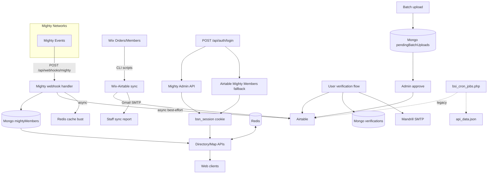
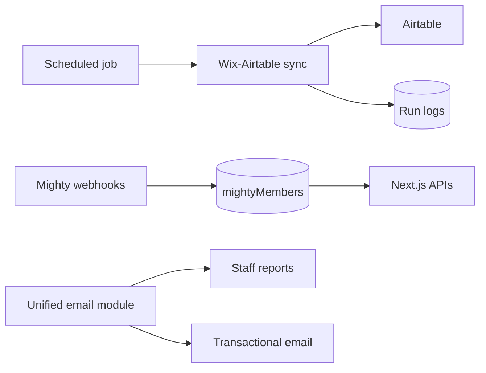

# BSN Platform — Master Document

**Canonical reference for architecture, operations, integrations, testing, and risks.**  
**Last updated:** 2026-05-09 (UTC), **revised** to reflect the shipped Mighty Networks integration. Replace this date when you materially change the system or this file.

**How to use this doc:** Start here for the full picture. Deep dives live in linked files below (security analysis, Render setup, batch workflows, etc.). If this file disagrees with an older doc (notably `BSN_MEMBERSHIP_ONBOARDING_ARCHITECTURE.md` on Mighty Networks), **trust this master document and the code** for the Mighty slice.

---

## Table of contents

1. [Executive summary](#1-executive-summary) (includes [integration status / fixes](#integration-status-current-fixes))
2. [Business architecture](#2-business-architecture)
3. [Technical architecture](#3-technical-architecture)
4. [Systems and integrations](#4-systems-and-integrations)
5. [Data stores and collections](#5-data-stores-and-collections)
6. [End-to-end flows](#6-end-to-end-flows)
7. [API and automation index](#7-api-and-automation-index)
8. [Authentication and sessions](#8-authentication-and-sessions)
9. [Testing and quality](#9-testing-and-quality)
10. [Deployment and performance](#10-deployment-and-performance)
11. [Security](#11-security)
12. [Risks, failure modes, and branch-history themes](#12-risks-failure-modes-and-branch-history-themes)
13. [Recommended evolution](#13-recommended-evolution)
14. [Subsidiary documents](#14-subsidiary-documents)
15. [Diagrams](#15-diagrams)
16. [Open questions](#16-open-questions)
17. [Stakeholder summary (plain English)](#17-stakeholder-summary-plain-english)

---

## 1. Executive summary

### Business

Black Sustainability Inc. (BSN) operates a **member directory and map** so the community can discover members, impact areas, and geography. **Paid membership and visibility rules** must stay aligned with billing and community policy. **Mighty Networks** is the community platform; **Airtable** remains the operational roster for many fields and staff workflows; **Wix** historically anchors scripted billing reconciliation into Airtable. The product competes on **trust, discoverability, and operational efficiency**—so data consistency, security, and performance directly affect mission outcomes and growth.

### Technical

The application is a **Next.js 14** (Pages Router) monolith: React UI, `pages/api/*` backends, **MongoDB** for runtime data, **Redis** for caching map/list/search, and **Airtable / Wix / Mighty** APIs. **Directory, map markers, search, and filter APIs read from `mightyMembers`** (not from legacy `airtableRecords` or static `api_data.json`). **Mighty webhooks** keep `mightyMembers` fresh, **geocode** missing coordinates when profile location text exists, **upsert the Airtable “Mighty Members” sync table** best-effort, and **bust Redis** so users see updates quickly. **Wix→Airtable CLI scripts** still enforce **Airtable** paying / need-payment flags for staff workflows. Legacy paths remain: **PHP cron**, some **`airtableRecords`** writes, **email verification + JWT**, and **multiple SMTP stacks** (Mandrill, Gmail sync reports, NextAuth).

### Master insight

The **live member directory and map are Mighty-backed**: Mongo **`mightyMembers`** is the runtime source of truth for those APIs, fed by **Mighty webhooks** (and optional **Airtable→Mongo** jobs such as `utils/sync-airtable.js` for the Mighty Members table). **Map/list self-visibility** for logged-in users uses **Mighty subscription data** (`subscription.isPaidActive` on the member doc), not the Airtable “Paying Member” field. **Airtable** remains important for staff operations and Wix reconciliation; **Wix** remains the scripted authority for classic paying flags on the main roster where that sync is still used. Operators should still track **cache TTL**, **webhook delivery**, and **drift** between Mighty-paid vs Wix/Airtable-paid semantics.

### Integration status (current fixes)

These items reflect **what the current integration implements** (supersedes older docs that said Mighty was “not wired in”):

| Area | Status |
|------|--------|
| **Mighty → Mongo** | Webhook `POST /api/webhooks/mighty` upserts **`mightyMembers`**; supports thin payloads via Admin API fetch-by-id; hardened auth (**multiple secret header names**, diagnostics on 401). |
| **Mighty → Airtable** | Async `upsertAirtableMightyMember` from webhook (non-blocking; failures logged). |
| **Cache coherence** | `invalidateMightyMemberCaches` after webhook upserts and member location updates so map/directory/search keys are not stale. |
| **Geocoding** | Webhook pipeline uses **Photon** (`geocodePhotonFreeText`) when location string is present and coordinates are missing. **On by default**; set `MIGHTY_WEBHOOK_GEOCODE=false` or `0` to disable (`lib/mightyWebhook.ts`). |
| **Sign-in** | `POST /api/auth/login` resolves members via **Mighty Admin API**; **fallback** to **Airtable Mighty Members** row when Mighty lookup misses but `mightyId` exists; issues **`bsn_session`** cookie (`lib/bsnSession.ts`). |
| **Session-aware APIs** | `GET /api/auth/session`, `GET /api/member/me` use **`bsn_session`**; location prompt/opt-out and update-location require session. |
| **Map gating** | `getExcludeViewerMighty` in `lib/mapViewerGating.js`: non–paid-active viewers **do not see their own pin** (fail-closed if `isPaidActive` is not `true`); **impersonation** allowlist can force “paid” view for testers. Viewer identity resolves **`bsn_session` first**, then NextAuth / legacy cookies. |
| **API response shape** | `toAirtableishDoc` / `mightyMemberAirtableShape` keeps **client expectations stable** while the backing store is `mightyMembers`. |
| **Location sync** | `member/update-location` updates **Mongo**, **Mighty custom field** (map location), **Airtable** upsert path, and **cache invalidation** (see tests in `__tests__/api/member-update-location.test.ts`). |
| **Industry / filters** | Directory filters aligned with **PRIMARY industry** labels and `mightyMembers` field shapes (legacy Airtable-only quirks addressed in recent commits). |
| **Cron / backfill** | **Airtable “Mighty Members” table → Mongo `mightyMembers`** remains available via `utils/sync-airtable.js` (and related ops); schedule is **outside the repo**. |

---

## 2. Business architecture

### 2.1 Capabilities

| Capability | Outcome | Depends on |
|------------|---------|------------|
| Directory & map | Discovery, network effect | `mightyMembers`, Mapbox, Redis, gating rules |
| Mighty community access | Logged-in experience, profile source | Mighty API, webhooks, `bsn_session` |
| Paid / equity / visibility policy | Fair access, revenue integrity | Wix scripts → Airtable; Mighty subscription signals; map gating |
| Staff operations | Roster control, bulk intake | Airtable, admin APIs, batch upload queue |
| Reliability & speed | Retention, support load | Render, cache warmup, Redis |

### 2.2 Stakeholders

- **Members:** Sign in (Mighty path), update location, appear on map when rules allow.
- **Staff:** Reconcile billing, approve batch uploads, monitor sync reports.
- **Engineering:** Maintain integrations, fix drift between Wix, Mighty, Airtable, Mongo.

### 2.3 Business risks tied to tech

- **Drift** between Wix-paid, Mighty-paid, and Airtable flags → wrong visibility or support tickets.
- **Incomplete geodata** (e.g. missing coordinates reports under `reports/`) → weak map experience.
- **Security debt** → limits grants, partnerships, and enterprise-style offerings (see `COMPREHENSIVE_ANALYSIS_2026.md`).
- **Bus factor:** Git history shows contributor concentration; knowledge risk for runbooks and edge cases.

---

## 3. Technical architecture

### 3.1 Stack

- **Framework:** Next.js 14, React 18, TypeScript (plus legacy JS API routes).
- **UI:** Tailwind, MUI, Emotion, Headless UI, Mapbox GL / react-map-gl, Leaflet (dependencies present), Formik, RJSF, etc.
- **Runtime data:** MongoDB (`mongodb` / `mongoose` where used).
- **Cache:** Redis (`ioredis`).
- **Auth:** **Primary:** Mighty-backed **`POST /api/auth/login`** + **`bsn_session`** HttpOnly cookie (`SESSION_SECRET`). **Secondary:** NextAuth email / Mongo adapter (`pages/api/auth/[...nextauth].js`); **legacy** email verification + JWT (`send-verification` / `verify-code`).
- **External APIs:** Wix SDK, Mighty Admin API, Airtable REST, Cloudinary, Google Analytics Data API.

### 3.2 Repository layout (high level)

| Area | Role |
|------|------|
| `pages/` | Routes and `pages/api/*` HTTP handlers |
| `lib/` | Integrations, reconciliation, gating, cache invalidation, session |
| `features/` | Feature modules (e.g. free signup) |
| `components/` | Shared UI |
| `scripts/` | CLI: Wix↔Airtable sync, dry runs, backfills, reports |
| `public/` | Static assets; `bsi_cron_jobs.php` (legacy) |
| `__tests__/`, `**/__tests__/**` | Jest tests |

### 3.3 Key library modules (`lib/`)

- **Mighty:** `mightyWebhook.ts`, `mightyAdmin.ts`, `mightyCacheInvalidate.ts`, `airtableMightyMembers.ts`, `mightyMemberAirtableShape.js`
- **Wix / billing:** `wix/*`, `billing/aggregateAuthorization.ts`, `reconciliation/*`
- **Data / infra:** `mongodb.js`, `redis.js`, `geocodePhoton.ts`, `mapViewerGating.js`
- **Session / testing:** `bsnSession.ts`, `impersonation.ts`
- **Notifications:** `notifications/sendSyncReportEmail.ts`

---

## 4. Systems and integrations

### 4.1 Mighty Networks (current — **implemented**)

See **[Integration status (current fixes)](#integration-status-current-fixes)** for the shipped behavior. Summary:

- **Webhooks:** `POST /api/webhooks/mighty` — `MIGHTY_WEBHOOK_TOKEN` with **multiple accepted header names**; upsert **`mightyMembers`**; optional **Admin API** fetch when payload lacks full member; **Photon geocode** when coords missing but location text present (feature-flagged in code).
- **Airtable sync table:** Async **`upsertAirtableMightyMember`** (Mighty Members / sync base — env-driven IDs).
- **Cache:** **`invalidateMightyMemberCaches`** on webhook and on location update.
- **Sign-in:** `pages/api/auth/login.ts` — **Mighty** `mightyGetMemberByEmail`, then **Airtable Mighty Members** fallback if Mighty misses but **`mightyId`** is on file; sets **`bsn_session`**.
- **Admin API:** `mightyAdmin.ts` — members, custom field answers (e.g. `MIGHTY_MAP_LOCATION_CUSTOM_FIELD_ID`).
- **Env (see `.env.example`):** `MIGHTY_NETWORK_ID`, `MIGHTY_NETWORK_API_KEY`, `MIGHTY_MAP_LOCATION_CUSTOM_FIELD_ID`, `MIGHTY_WEBHOOK_TOKEN`, `SESSION_SECRET`, etc.

### 4.2 Airtable

- Operational member records, views, `Paying Member (keep current)`, equity flags, batch upload targets.
- Clients/helpers: `lib/reconciliation/airtableClient.ts`, `lib/airtableMightyMembers.ts`, `lib/airtableConfig.ts`, many `pages/api/airtable/*` routes.

### 4.3 Wix

- Orders and members via `@wix/sdk`; scripts reconcile subscription state to Airtable paying fields.
- Entrypoints: `scripts/wix-airtable-sync-dryrun.ts`, `scripts/wix-airtable-sync-apply.ts`, `npm run wix-*`.

### 4.4 MongoDB

- **`mightyMembers`:** Primary serving collection for directory/map APIs (`getData`, `filterData`, `getMarkers`, `member-records`, etc.).
- **`airtableRecords`:** Legacy/cached Airtable shape; still used by some update paths (e.g. `pages/api/updateMember.ts`).
- **`verifications`:** Email verification codes.
- **`pendingBatchUploads`:** Staging for batch intake.
- **NextAuth:** Adapter database (e.g. `orgUserData` per onboarding doc).

### 4.5 Redis

- Cached responses for heavy list/map endpoints; key patterns versioned (e.g. `getData:v8:...`, `search:v3:mightyMembers:*` in `mightyCacheInvalidate.ts`).

### 4.6 Email

1. **Mandrill** — verification codes, batch confirmations (`MAILCHIMP_API_KEY`).
2. **Gmail SMTP** — Wix→Airtable sync staff reports (`EMAIL_USER`, `EMAIL_PASSWORD`, etc.).
3. **NextAuth Email provider** — magic links (`EMAIL_SERVER_*`, `EMAIL_FROM`).

### 4.7 Maps and media

- **Mapbox** (`mapbox-gl`, `react-map-gl`), clustering (`supercluster`, `@googlemaps/markerclusterer`).
- **Cloudinary** for images.
- **Geocoding:** Photon (`geocodePhoton.ts`), webhook/geocode flows for missing coords.

### 4.8 Legacy / parallel

- **`public/bsi_cron_jobs.php`:** Fetches Airtable, writes `public/api_data.json`, images, geocoding — runs outside repo definition (external cron).
- **`utils/sync-airtable.js`:** Airtable → Mongo `mightyMembers` upsert patterns for cron/sync jobs.

---

## 5. Data stores and collections

### 5.1 Identity

- **Email** is the primary join key across Wix, Airtable (`EMAIL ADDRESS`), and Mighty; **`bsn_session`** stores normalized email + **`mightyId`** after login.
- **Legacy note:** `getExcludeViewerId` in `mapViewerGating.js` still matches **`airtableRecords`-shaped** docs by `fields.EMAIL ADDRESS` for older code paths; **`getMarkers` / `getData` / `filterData` / `searchData` use `getExcludeViewerMighty` + `mightyMembers`**.

### 5.2 Mighty member document (conceptual)

Webhook normalization stores profile fields (names, bio, avatar, location text, lat/lng when present), **mightyId**, subscription summary, and timestamps — exact schema in `lib/mightyWebhook.ts` and Mongo writes.

### 5.3 Paying / visibility

- **Airtable (staff / Wix sync):** `Paying Member (keep current)`, `Equity Member (keep current)`, `Send Need Payment Email`, `MEMBER LEVEL` — still updated by **Wix→Airtable scripts** and admin flows where applicable.
- **Mighty (directory & map APIs):** Webhook writes **`subscription.isPaidActive`**, plan ids/names, statuses on **`mightyMembers`**. This is what **map/list self-exclusion** uses: only viewers with **`subscription.isPaidActive === true`** see their own marker; missing/unknown subscription is treated as **not paid** (fail-closed).
- **Tester override:** Allowlisted **impersonation** cookie can simulate paid mode without changing real subscription data (`lib/impersonation.ts`).

### 5.4 Known data-quality artifacts

- **Missing coordinates:** e.g. `reports/missing-coordinates-*.csv` / `.json` from reporting scripts — indicates ongoing geodata gaps.

---

## 6. End-to-end flows

### 6.1 Paid membership enforcement (Wix → Airtable)

1. Run `npm run wix-airtable-sync-apply` (or dry run).
2. Fetch Wix orders + resolve member emails; `aggregateAuthorization` applies business rules.
3. Load Airtable view; `computeWixAirtableDiff` detects duplicates/missing.
4. Patch `Paying Member (keep current)` and `Send Need Payment Email`.
5. Email staff via `sendSyncReportEmail`.

**Gap:** Scheduler not defined in repo; often external/manual.

### 6.2 Mighty-driven member sync (events → Mongo → Airtable → cache)

1. Mighty sends webhook to `/api/webhooks/mighty`.
2. Validate secret; normalize payload; upsert **`mightyMembers`** (fetch member from API if needed).
3. **Geocode** when location text exists and coordinates are absent (if enabled).
4. Async **Airtable** upsert + **Redis** cache bust for map/directory/search key families.

**Parallel:** Scheduled or manual **`utils/sync-airtable.js`** can refresh **`mightyMembers`** from the **Airtable Mighty Members** table when webhooks lag or for backfill.

### 6.3 Directory / map read path

1. Client calls **`getData`**, **`filterData`**, **`searchData`**, **`getMarkers`**, **`member-records`**, etc. — all backed by **`mightyMembers`** + Redis (with **viewer-specific cache bypass** when the API excludes the viewer’s own non-paid pin).
2. **`getExcludeViewerMighty`** uses **`bsn_session` / NextAuth**-derived email and the viewer’s **`mightyMembers`** subscription fields.
3. Responses are shaped for existing clients via **`toAirtableishDoc`** where used.
4. Mapbox renders markers/clusters; industry filters use **PRIMARY** industry alignment (`buildIndustryHouseQuery.js` and related).

### 6.4 Profile verification (legacy JWT path)

1. `POST /api/auth/send-verification` — Airtable must contain email; code in Mongo; Mandrill sends email.
2. `POST /api/auth/verify-code` — JWT issued for profile access.

**Note:** **Primary member UX** is **Mighty email login + `bsn_session`**. The verification-code JWT path is **secondary** (e.g. older profile access flows); prefer documenting user journeys against **`/api/auth/login`** and **`bsn_session`** for the integrated product.

### 6.5 Batch upload

1. `POST /api/batch-upload` → `pendingBatchUploads`.
2. Admin `POST /api/admin/pending-batch-uploads` → Airtable create/update.

### 6.6 Free signup

- `POST /api/register-free-submit` → Airtable (see `features/freeSignup/`).

### 6.7 Member location updates

- `pages/api/member/update-location.ts` — updates Mongo/Airtable/Mighty custom field per implementation; tests in `__tests__/api/member-update-location.test.ts`.
- Location prompt opt-out: `pages/api/member/location-prompt-optout.ts`.

### 6.8 Tester impersonation

- `pages/api/test/impersonate.ts` with allowlist (`BSN_IMPERSONATE_ALLOWLIST`, `BSN_IMPERSONATE_SECRET` in `.env.example`).

---

## 7. API and automation index

### 7.1 Representative API routes (`pages/api/`)

- **Auth:** `[...]nextauth`, `send-verification`, `verify-code`, `login`, `logout`, `session`, `check-token`, Mandrill variant
- **Member:** `member/me`, `member/update-location`, `member/location-prompt-optout`
- **Data:** `getData`, `filterData`, `searchData`, `getMarkers`, `member-records`, `getSingleRecord`, `updateMember`, etc.
- **Admin:** `admin/login`, `admin/register`, `admin/verify`, users CRUD, `pending-batch-uploads`, `backfills/nonpaying`
- **Webhooks:** `webhooks/mighty`
- **Test:** `test/impersonate`

*Full list: scan `pages/api/` — this master doc does not duplicate every file.*

### 7.2 Scripts (`npm run` and `scripts/`)

- `wix-airtable-sync-dryrun` / `wix-airtable-sync-apply`
- `wix-fetch`, setup forms, cache warmup (`postbuild` → `scripts/simple-cache-warmup.js`), `warm-cache`
- Dry runs / reports: Airtable vs Mongo industry alignment, missing coordinates, non-paying reconciliation, etc. (see `scripts/README_SCRIPTS.md` if present)

---

## 8. Authentication and sessions

| Mechanism | Purpose | Key files / env |
|-----------|---------|-----------------|
| **Mighty login + `bsn_session`** | **Primary:** `POST /api/auth/login` looks up **Mighty** by email; **Airtable Mighty Members** fallback if Mighty misses but `mightyId` exists; sets **30-day** HS256 JWT **HttpOnly** cookie | `pages/api/auth/login.ts`, `lib/mightyAdmin.ts`, `lib/airtableMightyMembers.ts`, `lib/bsnSession.ts`, `SESSION_SECRET` |
| **bsn_session** | Parsed via `getBsnSessionFromReq` for APIs and map gating | `lib/bsnSession.ts` |
| **NextAuth** | Email magic links, Mongo adapter (secondary path; gating falls back after `bsn_session`) | `pages/api/auth/[...nextauth].js` |
| **Verification JWT** | Short-lived token after code verify (legacy/supplementary profile access) | `JWT_SECRET`, `verify-code` |
| **Impersonation** | Allowlisted QA: simulate paid vs unpaid map visibility | `BSN_IMPERSONATE_*`, `lib/impersonation.ts`, `/api/test/impersonate` |

---

## 9. Testing and quality

- **Runner:** Jest + Testing Library; config `jest.config.js`, setup `jest.setup.ts`.
- **Command:** `npm test`.
- **Recent status:** 11 suites / 49 tests passing (verify locally after changes).
- **Coverage areas:** Mighty webhook, Airtable Mighty upsert, member location APIs, impersonation, send-verification, map gating, free signup components, confirmation modal.
- **Gaps:**
  - `tsconfig.json` **excludes** tests from TypeScript project check.
  - **No `.github/workflows`** in repo — CI may be host-only (e.g. Render build); no guaranteed PR test gate in Git.
  - **No Playwright/Cypress** in `package.json` for full E2E.

---

## 10. Deployment and performance

- **Platform:** Documented **Render** usage — `RENDER_SETUP.md`.
- **Post-build:** `postbuild` runs `scripts/simple-cache-warmup.js`; optional `RENDER_EXTERNAL_URL`.
- **Runtime caching:** Redis for API responses; invalidation on Mighty webhook.
- **Historical issue themes:** “Slow loading,” speed-improvement branches — performance is a recurring product/engineering theme.

---

## 11. Security

**Do not treat this section as a full audit.** For prioritized findings (framework CVE class issues, admin auth patterns, rate limiting, etc.), read:

- **`COMPREHENSIVE_ANALYSIS_2026.md`**
- **`CRITICAL_SECURITY_ALERT.md`**, **`SECURITY_UPDATE_REPORT.md`**, **`SECURITY_UPGRADE_RECOMMENDATIONS.md`**, **`SECURITY_UPDATE.md`** (verify which are still current)

**Operational practices:** Rotate webhook tokens and API keys; restrict admin routes; review impersonation allowlists in production.

---

## 12. Risks, failure modes, and branch-history themes

### 12.1 Mitigated or clarified by the current integration

- **“Mighty not in codebase”** — **Resolved:** webhooks, login, `mightyMembers`, Airtable upsert, cache bust, geocode path, location API.
- **Stale map after profile updates** — **Largely mitigated:** Redis invalidation on webhook and location update.
- **Webhook 401 / secret mismatch** — **Mitigated:** multiple header names + logging (still rotate secrets carefully).
- **Unclustered Mapbox markers / envelope bugs** — Addressed in recent map + webhook payload handling (verify in QA after upgrades).
- **Industry filter / legacy record shape** — **Mitigated** for `mightyMembers`-backed directory (PRIMARY labels, pagination fixes per history).

### 12.2 Remaining architectural / data risks

- **Dual “paid” semantics:** **Mighty `isPaidActive`** drives **map self-visibility**; **Airtable / Wix** drive **staff-facing paying flags** — they can disagree until processes align.
- **Multiple authorities:** Wix, Mighty, Airtable, Mongo — **per-field ownership** should still be documented.
- **Duplicate Airtable emails:** Wix→Airtable sync can still pick first record (`computeWixAirtableDiff`).
- **Unresolved Wix emails:** Orders skipped → Airtable not marked paying.
- **Formula injection / escaping:** Some `filterByFormula` builders still interpolate raw strings.
- **Welcome / need-payment email:** Flags may be set without an automated sender (onboarding gap).

### 12.3 Themes from branch names and commits (illustrative)

Recurring branches and fixes point to:

- **Performance:** `slow-loading-fix*`, `speed-improvements*`, `lazy-load-pins`
- **Search / directory:** `searching-improvment*`, directory layout commits
- **Map / UI:** `overlay-implementation*`, `map-improvments`, impact area data
- **Bugs:** `images-showing-issue`, `cookies-issue`, `read-more-button*`, profile icon fixes
- **Integrations:** `mighty-network-auth`, `wix-billing-enforcement`, `mongodb-integration`, `feature/form-sync-airtable-mongodb`
- **Engineering hygiene:** TypeScript/build fixes, webhook 401 diagnostics, Redis bust after webhooks, industry filter alignment

Use **`git branch -a`** and **`git log`** for live detail; this list is not exhaustive.

---

## 13. Recommended evolution

**Done or largely done (keep monitoring):** Mighty↔Mongo↔Airtable webhook path, **`bsn_session`** login with Airtable fallback, **`mightyMembers`**-backed directory/map, Redis invalidation, map gating on Mighty subscription, location sync API, geocode-on-webhook (when enabled).

**Still recommended:**

1. **Single field-ownership matrix** (Wix vs Mighty `isPaidActive` vs Airtable paying fields) — document **which UI uses which** to avoid staff confusion.
2. **Scheduled, logged Wix→Airtable job** in the hosting platform with persisted run history (Mongo or object storage).
3. **Unify email** behind one internal module/provider where possible.
4. **CI:** GitHub Actions (or equivalent) running `npm test` and `npm run lint` on PRs.
5. **Retire or fence legacy** PHP cron and `api_data.json` if no remaining consumers; document any that stay.
6. **Security roadmap** from `COMPREHENSIVE_ANALYSIS_2026.md` — track to completion with re-audit.
7. **Coordinate backfill** — use `reports/missing-coordinates-*` and scripts until map completeness targets are met.

---

## 14. Subsidiary documents

| Document | Topic |
|----------|--------|
| `BSN_MEMBERSHIP_ONBOARDING_ARCHITECTURE.md` | Deep Wix/Airtable onboarding flows; **Mighty** details — use **[Integration status](#integration-status-current-fixes)** + §4.1 here |
| `COMPREHENSIVE_ANALYSIS_2026.md` | Security, dependencies, growth framing |
| `RENDER_SETUP.md` | Cache warmup, Render env |
| `NEXTAUTH_SETUP.md` | NextAuth configuration |
| `ADMIN_SYSTEM_README.md`, `pages/admin/BATCH_UPLOAD_README.md` | Admin / batch |
| `BATCH_UPLOAD_*.md`, `scripts/*README*` | Batch and scripts |
| `PERFORMANCE_*.md`, `CLIENT_EMAIL_*.md` | Performance and comms |
| `data/BSN_VALID_OPTIONS_REFERENCE.md` | Field options |
| `scripts/TROUBLESHOOTING.md` | Script issues |

---

## 15. Diagrams

### 15.1 Current-state integration (simplified)

### 15.2 Target operational pattern (recommended)

---

## 16. Open questions

- Where exactly is **Wix→Airtable** scheduled in production, and who owns on-call if it fails?
- Is **legacy PHP cron** still required, or can all consumers move to **`mightyMembers` APIs** only?
- **Welcome email** and **need-payment email** automation: which Airtable fields are canonical triggers today?
- **Production Airtable view IDs** per environment — documented outside code?
- **NextAuth vs Mighty-first login:** product intent for sunsetting or demoting duplicate paths now that **`bsn_session`** is primary?

---

## 17. Stakeholder summary (plain English)

- **Members** use **email sign-in** that checks **Mighty** first; if needed, a **directory record** in Airtable can still establish a session when **Mighty ID** is already known. The **map and member listing** run off data synced into our database from **Mighty** (and supporting jobs), with **caches cleared** when profiles change.
- **Who sees themselves on the map** when logged in follows **Mighty subscription status** in that synced data (paid-active members can see their pin; others generally cannot).
- **Paying flags in the main Airtable workflows** used by staff may still be updated by **Wix scripts**; those scripts are separate from Mighty’s live subscription signal—both should stay aligned operationally.
- **Staff** still use **Airtable** for many operational tasks; **batch uploads** go through a **pending** step before records are written.
- **Coordinates and industry data** are improved by **webhook geocoding**, **location updates**, and backfill scripts, but **data-quality reports** may still flag gaps until fully cleared.
- **Security improvements** in the separate analysis docs remain important for long-term trust and partnerships.

---

*End of master document. Update the “Last updated” line when you change systems or this file.*
