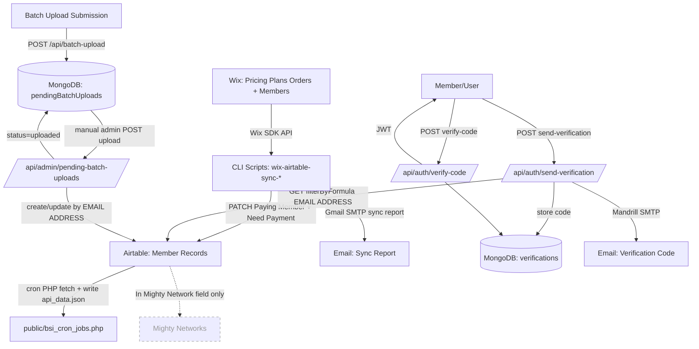

# BSN Membership Onboarding Architecture

> **Canonical overview:** See [`BSN_MASTER_DOCUMENT.md`](./BSN_MASTER_DOCUMENT.md) for the full platform architecture (including current Mighty Networks integration). This file remains useful for detailed onboarding flows; the Mighty “not in codebase” statements below are **out of date**—webhooks and `mightyMembers` are implemented.

## 1. Executive Summary
Today, BSN membership onboarding is **not one single automated pipeline**—it’s a set of connected flows:

- **Paid membership status (“who is paying”) is derived from Wix subscription orders** and periodically reconciled into Airtable by running **repo scripts** that set Airtable’s `Paying Member (keep current)` flag (and `Send Need Payment Email`).
- **Airtable functions as the operational member record system** (profile fields, map visibility data, flags like paying/equity/need-payment).
- **Email is used for three different purposes**: (1) verification codes to access a profile, (2) confirmation emails for batch uploads, and (3) “sync report” emails to staff after Wix→Airtable reconciliation runs.
- **Mighty Networks is not confirmed as integrated in code** (there are fields like `"In Mighty Network"` in data/types, but no API/scripts/webhooks that connect to Mighty Networks).
- **Wix “site-member approval” automation is not confirmed in code** (Wix is used for orders + members lookup only; no approval actions were found).

## 2. Systems Involved

### Airtable
- **Purpose in the workflow**: Member “system of record” for profile data + operational flags used by the app and staff.
- **What data it stores or controls**: Member profile fields (`FIRST NAME`, `LAST NAME`, `BIO`, `PHOTO`, location, etc.) and membership operations fields like `Paying Member (keep current)`, `Equity Member (keep current)`, `Send Need Payment Email`.
- **Role**: **Operational onboarding tracker** + **downstream destination** for billing enforcement (paying flag is written into Airtable).

Key code:
- `lib/reconciliation/airtableClient.ts`
- `pages/api/submitForm.js`
- `pages/api/airtable/get-user.ts`
- `pages/api/admin/pending-batch-uploads.ts`
- `pages/api/register-free-submit.ts`

### Wix (Members + Pricing Plans Orders)
- **Purpose in the workflow**: Holds billing/subscription order data; provides member emails via Wix members lookup.
- **What data it stores or controls**: Pricing plan orders with status/payment state; member records and emails.
- **Role**: **Appears to be source of truth for paid membership status**, because the sync scripts explicitly treat Wix as authority and patch Airtable accordingly.

Key code:
- `lib/wix/client.ts`
- `lib/wix/fetchSubscriptions.ts`
- `lib/billing/aggregateAuthorization.ts`
- `scripts/wix-airtable-sync-dryrun.ts`
- `scripts/wix-airtable-sync-apply.ts`

### Mighty Networks
- **Purpose in the workflow**: Intended/desired downstream community access system (inferred from fields/docs).
- **What data it stores or controls**: Not confirmed in codebase.
- **Role**: **Not confirmed in codebase** (no API integration found).

Evidence of “mention only”:
- `typings.d.ts` includes `"In Mighty Network"?: boolean;`
- `utils/AirtableResults.json` contains `"In Mighty Network": true` values (data sample), but no automation uses it.

### Email Provider(s)
There are multiple email mechanisms currently present:

1) **Mandrill/Mailchimp SMTP**
- **Used for**: verification code emails + batch-upload confirmation emails.
- **Key env**: `MAILCHIMP_API_KEY`
- **Key code**:
  - `pages/api/auth/send-verification.ts` (smtp.mandrillapp.com)
  - `pages/api/batch-upload.ts` (smtp.mandrillapp.com)

2) **Gmail SMTP**
- **Used for**: Wix→Airtable sync report emails to staff.
- **Key env**: `EMAIL_USER`, `EMAIL_PASSWORD`, optional `SYNC_REPORT_FROM`
- **Key code**: `lib/notifications/sendSyncReportEmail.ts`

3) **NextAuth Email Provider (SMTP)**
- **Used for**: authentication via email sign-in links (NextAuth).
- **Key env**: `EMAIL_SERVER_HOST`, `EMAIL_SERVER_PORT`, `EMAIL_SERVER_USER`, `EMAIL_SERVER_PASSWORD`, `EMAIL_FROM`, `NEXTAUTH_SECRET`
- **Key code**: `pages/api/auth/[...nextauth].js`

### Backend server (Next.js API routes)
- **Purpose**: Hosts API endpoints for Airtable reads/writes, MongoDB-backed workflows, auth/verification, admin batch upload processing.
- **Role**: Operational glue between Airtable + MongoDB + email.

Key areas:
- `pages/api/**`

### MongoDB
- **Purpose**: Stores cached Airtable records (`airtableRecords`), pending batch uploads, verification codes, NextAuth users/sessions (via adapter).
- **Role**: Operational datastore for app runtime + admin workflows.

Key code:
- `pages/api/batch-upload.ts` (`pendingBatchUploads`)
- `pages/api/admin/pending-batch-uploads.ts`
- `pages/api/auth/send-verification.ts` / `verify-code.ts` (`verifications`)
- `pages/api/auth/[...nextauth].js` (MongoDBAdapter DB `orgUserData`)
- `pages/api/updateMember.ts` (writes to `airtableRecords`)

### Redis
- **Purpose**: Caching for map/list endpoints.
- **Role**: Performance support (not onboarding authority).

Key code:
- `pages/api/getMarkers.js` (Redis cache + viewer gating)
- `pages/api/updateMember.ts` (clears `search:*` keys)

### Schedulers / cron
- **Wix→Airtable sync scheduler**: **Not confirmed in codebase** (scripts exist but no scheduler configuration present).
- **PHP cron script exists**: pulls Airtable → writes `public/api_data.json` and downloads images/geocodes.

Key code:
- `public/bsi_cron_jobs.php`

## 3. Current End-to-End Flow

### Flow A — Paid membership syncing (Wix → Airtable “Paying Member” enforcement)
1) **Triggering action**
- Manual or external scheduler runs CLI: `npm run wix-airtable-sync-apply` (or dry run).
- **System**: Local/CI/cron environment (not defined in repo), Wix, Airtable, Gmail SMTP.
- **Files**:
  - `scripts/wix-airtable-sync-apply.ts`
  - `lib/reconciliation/wixAuthority.ts`
  - `lib/wix/fetchSubscriptions.ts`
  - `lib/billing/aggregateAuthorization.ts`
  - `lib/reconciliation/computeWixAirtableDiff.ts`
  - `lib/reconciliation/airtableClient.ts`
  - `lib/notifications/sendSyncReportEmail.ts`
- **Whether automated or manual**: **Manual in repo** (scheduler not confirmed).
- **Known gap or failure point**: If no scheduler exists, enforcement depends on someone running scripts.

2) **Fetch Wix orders + resolve emails**
- Wix API call via `createWixClient()` and `client.orders.managementListOrders(...)`
- Emails resolved via `client.members.getMember(memberId, { fieldsets: ["FULL"] })`
- **Whether automated or manual**: Automated in script.
- **Known gap or failure point**: Orders where member email can’t be resolved are explicitly excluded from enforcement (“never used for deauthorization”).
  - `lib/wix/fetchSubscriptions.ts` returns `unresolvedRows`.

3) **Determine who is “authorized/paying”**
- `aggregateAuthorizations(subscriptions)` groups by email and marks authorized if any subscription matches:
  - `subscriptionStatus === "Free trial"` OR
  - `subscriptionStatus === "Active" && (lastPaymentStatus === "Paid" || "Pending")`
- **Known gap or failure point**: Business rules are hard-coded and may not match all real billing states.

4) **Read Airtable member list from a view**
- `fetchAllFromView({ apiKey, baseId, tableId, viewId })`
- **Known gap or failure point**: Relies on correct `AIRTABLE_*` envs and view id. Default view fallback exists in script:
  - `scripts/wix-airtable-sync-apply.ts` defaults `AIRTABLE_VIEW_ID` to `"viwYDUY0xStG108Lv"` if missing.

5) **Compute diff + handle duplicates/missing**
- `computeWixAirtableDiff(...)`:
  - Detects **duplicate emails in Airtable** (`duplicatesInAirtable`)
  - Detects **missing in Airtable** (`missingInAirtable`)
  - Skips a hardcoded “equity-protected” email set
- **Known gap or failure point**: Duplicate Airtable emails are reported but the script still picks the **first record** for updates (record `records[0]`).

6) **Patch Airtable fields**
- `patchPayingMember(...)` sets:
  - `Paying Member (keep current)` = paying
  - and (by default) `Send Need Payment Email` = `!paying`
- **Known gap or failure point**: Airtable API limits; script delays 250ms between patches to stay under ~5 req/sec.

7) **Send staff report email**
- `sendSyncReportEmail(report)` sends to:
  - To: `kelyce@blacksustainability.org`
  - CC: `info@blacksustainability.org`
- **Whether automated or manual**: Automated within script, but depends on `EMAIL_USER`/`EMAIL_PASSWORD`.
- **Known gap or failure point**: Email send errors are logged but **do not fail the sync**.

---

### Flow B — Member “profile access” verification (Airtable → MongoDB → Email → JWT)
1) **Triggering action**
- User requests verification code via POST `/api/auth/send-verification`
- **System**: Next.js API, Airtable, MongoDB, Mandrill SMTP.
- **File**: `pages/api/auth/send-verification.ts`
- **Whether automated or manual**: Automated.

2) **Identity match**
- Looks up Airtable record using:
  - `filterByFormula: {EMAIL ADDRESS} = '${email}'`
- **Known gap or failure point**: Exact email match; if user types a different email than Airtable, they get `404 Email not found in our records`.

3) **Verification code issued**
- Stores `{ email, code, expiresAt, verified:false, userData:{ firstName,lastName,recordId } }` in MongoDB collection `verifications`.

4) **Email sending**
- Sends verification email via `smtp.mandrillapp.com` using `MAILCHIMP_API_KEY`.
- Tries 3 SMTP auth/from configurations in sequence (domain mismatch workaround).

5) **User submits code**
- POST `/api/auth/verify-code`
- **File**: `pages/api/auth/verify-code.ts`
- Checks MongoDB `verifications` for `{ email, code, verified:false, expiresAt > now }`
- Issues JWT signed with `JWT_SECRET`, 1-hour expiry.

**Notes / gaps**
- This flow is for **profile access**, not confirmed to grant Wix or Mighty access.
- “Member approval” as a concept is not implemented here; it’s a verification gate only.

---

### Flow C — Batch upload intake (MongoDB pending) → manual admin action → Airtable write
1) **Triggering action**
- A batch upload is submitted to POST `/api/batch-upload`
- **File**: `pages/api/batch-upload.ts`
- **Whether automated or manual**: Automated intake.

2) **Data stored**
- Valid rows are stored in MongoDB `pendingBatchUploads` with `status: "pending"`.

3) **Email sent to submitters**
- Sends “Your BSN Account Will Be Created Shortly” confirmation via Mandrill SMTP.
- **Known gap or failure point**: The email claims a later “account ready” email will come, but no “account creation” automation is confirmed elsewhere in code.

4) **Manual admin review/approval**
- Admin uses GET/POST `/api/admin/pending-batch-uploads`
- **File**: `pages/api/admin/pending-batch-uploads.ts`
- On `action === "upload"`: iterates rows and calls `uploadRowToAirtable(...)`
  - Searches Airtable by `{EMAIL ADDRESS}`; updates existing record or creates new.
  - Uses `pages/api/submitForm.js`’s `updateRecord` and `submitToAirtable`.

5) **Upload marked complete**
- MongoDB pending record status set to `uploaded` (or `rejected`).

**Known gap or failure point**
- Airtable search is `filterByFormula={EMAIL ADDRESS}='${row.email}'` (no escaping); special characters could break.
- Duplicate emails in Airtable can cause “update the first found record” behavior.

---

### Flow D — Free signup writes directly to Airtable
1) **Triggering action**
- POST `/api/register-free-submit`
- **File**: `pages/api/register-free-submit.ts`
- **Whether automated or manual**: Automated.

2) **Writes directly to Airtable**
- Sends fields including `MembershipType: "Free"` and `Membership Status Notes: "Free"` plus location and profile basics.
- Uses `features/freeSignup/airtableUtils` (not inspected here), but it submits to Airtable.

**Known gap or failure point**
- This flow is separate from Wix billing logic; there’s no confirmed automatic upgrade path from “Free” to “Paying” except via Wix→Airtable reconciliation.

---

### Flow E — “Welcome emails” and “Mighty onboarding”
- **Welcome emails**: **Not confirmed in codebase as implemented**.
  - Evidence of intent exists in `BATCH_UPLOAD_FORM_EMAIL.md` (“Send welcome emails…”), and sample Airtable data has `Send Welcome Email`, but no worker/cron/script reads that field and sends a welcome email.
- **Mighty Networks onboarding**: **Not confirmed in codebase as implemented**.

## 4. Integration Map

### Implemented connections (confirmed in code)
- **Wix Orders/Members API → Reconciliation Scripts**
  - **What data moves**: orders + member email + plan + status
  - **How it moves**: direct Wix SDK API calls
  - **Where in the code**: `lib/wix/fetchSubscriptions.ts`, `lib/wix/client.ts`
  - **Type**: direct API

- **Reconciliation Scripts → Airtable**
  - **What data moves**: `Paying Member (keep current)` and `Send Need Payment Email`
  - **How it moves**: Airtable REST PATCH
  - **Where in the code**: `lib/reconciliation/airtableClient.ts`, orchestrated by `scripts/wix-airtable-sync-apply.ts`
  - **Type**: direct API

- **Reconciliation Scripts → Email (staff report)**
  - **What data moves**: summary + exception lists
  - **How it moves**: Gmail SMTP
  - **Where in the code**: `lib/notifications/sendSyncReportEmail.ts`
  - **Type**: SMTP

- **User Email → Airtable (verification eligibility check)**
  - **What data moves**: email address lookup
  - **How it moves**: Airtable REST GET with `filterByFormula`
  - **Where in the code**: `pages/api/auth/send-verification.ts`
  - **Type**: direct API

- **Verification flow → MongoDB**
  - **What data moves**: verification codes + expiry + userData
  - **How it moves**: MongoDB write/read
  - **Where in the code**: `pages/api/auth/send-verification.ts`, `pages/api/auth/verify-code.ts`
  - **Type**: DB

- **Verification flow → Email**
  - **What data moves**: one-time code
  - **How it moves**: Mandrill SMTP
  - **Where in the code**: `pages/api/auth/send-verification.ts`
  - **Type**: SMTP

- **Batch upload submissions → MongoDB**
  - **What data moves**: pending uploaded rows
  - **How it moves**: MongoDB insert
  - **Where in the code**: `pages/api/batch-upload.ts`
  - **Type**: DB

- **Admin approval → Airtable**
  - **What data moves**: create/update member records by email
  - **How it moves**: Airtable REST (search then patch/post)
  - **Where in the code**: `pages/api/admin/pending-batch-uploads.ts`, `pages/api/submitForm.js`
  - **Type**: direct API + manual trigger

- **Airtable → PHP cron output (map data)**
  - **What data moves**: Airtable view records → `api_data.json`, plus downloaded images and geocoded lat/lng
  - **How it moves**: Airtable REST GET + file writes + external geocode
  - **Where in the code**: `public/bsi_cron_jobs.php`
  - **Type**: cron-style script (execution environment not in repo)

### Not confirmed connections
- **Airtable → Mighty Networks**: not confirmed in codebase.
- **Wix → Mighty Networks**: not confirmed in codebase.
- **Wix site-member approval automation**: not confirmed in codebase.
- **Airtable “Send Welcome Email” → Email sending**: not confirmed in codebase.

## 5. Source of Truth Analysis
- **Source of truth for billing/payment status**: **Wix** (pricing plan orders). This is explicit in the reconciliation design (`Wix → Airtable` enforcement).
- **Operational onboarding tracker**: **Airtable**, plus MongoDB for staging (“pending batch uploads”) and verification codes.
- **What appears to control final access or community participation**:
  - **Map/app gating** is driven by **Airtable paying flag stored in MongoDB** (`airtableRecords`) for endpoints like `pages/api/getMarkers.js`.
  - **Mighty Networks access** is **not confirmed in codebase**, so “final community access” can’t be stated from code alone.
- **Conflicting sources of truth**:
  - Airtable paying field is **downstream** of Wix for paid members, but Airtable can also be written via admin/batch upload and free signup, so it can temporarily diverge until reconciliation runs.

## 6. Automation Inventory

- **Wix → Airtable paying flag enforcement (dry run/apply)**
  - **Name**: `wix-airtable-sync-dryrun` / `wix-airtable-sync-apply`
  - **Purpose**: Reconcile Wix subscription authorization to Airtable `Paying Member (keep current)`
  - **Trigger**: CLI execution (`npm run ...`); “scheduled” concept implied in email formatting but **scheduler not found**
  - **Destination**: Airtable PATCH + staff email report
  - **Key file paths**: `scripts/wix-airtable-sync-apply.ts`, `lib/reconciliation/*`, `lib/wix/*`, `lib/notifications/sendSyncReportEmail.ts`
  - **Status**: **Active (code complete), scheduling unclear**

- **Verification code email flow**
  - **Name**: `/api/auth/send-verification` and `/api/auth/verify-code`
  - **Purpose**: Let a user verify their email and receive a JWT token for profile access
  - **Trigger**: API calls (user action)
  - **Destination**: MongoDB + email
  - **Key file paths**: `pages/api/auth/send-verification.ts`, `pages/api/auth/verify-code.ts`
  - **Status**: **Active**

- **Batch upload intake + admin approval**
  - **Name**: `/api/batch-upload` + `/api/admin/pending-batch-uploads`
  - **Purpose**: Collect member rows, hold for review, then write to Airtable
  - **Trigger**: User submission + **manual admin action**
  - **Destination**: MongoDB pending + Airtable create/update + confirmation email
  - **Key file paths**: `pages/api/batch-upload.ts`, `pages/api/admin/pending-batch-uploads.ts`, `pages/api/submitForm.js`
  - **Status**: **Active**

- **Non-paying backfill**
  - **Name**: `/api/admin/backfills/nonpaying` (calls `runNonPayingBackfill`)
  - **Purpose**: Force-set non-paying flags and “need payment email” for a known list
  - **Trigger**: Manual API call (admin)
  - **Destination**: Airtable PATCH (and optional create)
  - **Key file paths**: `pages/api/admin/backfills/nonpaying.ts`, `lib/backfills/nonPayingBackfill.ts`
  - **Status**: **Active (admin tool)**

- **Airtable → `api_data.json` export (PHP cron)**
  - **Name**: `public/bsi_cron_jobs.php`
  - **Purpose**: Generate map dataset JSON, download photos, geocode missing coords
  - **Trigger**: External cron execution (not defined in repo)
  - **Destination**: `public/api_data.json` + `assets/*`
  - **Key file paths**: `public/bsi_cron_jobs.php`
  - **Status**: **Active/legacy script, execution environment unclear**

- **NextAuth email-based sign-in**
  - **Name**: NextAuth Email Provider
  - **Purpose**: Magic-link sign-in
  - **Trigger**: Auth flow (user action)
  - **Destination**: SMTP email
  - **Key file paths**: `pages/api/auth/[...nextauth].js`
  - **Status**: **Active**

## 7. Data Model / Key Fields

### Identity matching keys (most important)
- **Email**: `EMAIL ADDRESS` (Airtable), matched against Wix member login/contact email (`member.loginEmail` or first contact email), and used throughout as the primary join key.

Where used:
- Wix→Airtable sync: normalized lowercase emails (`lib/wix/fetchSubscriptions.ts`, `lib/reconciliation/computeWixAirtableDiff.ts`)
- Verification: exact Airtable `filterByFormula` match (`pages/api/auth/send-verification.ts`)
- Batch upload: Airtable lookup by email (`pages/api/admin/pending-batch-uploads.ts`)
- Map gating: MongoDB `airtableRecords.fields.EMAIL ADDRESS` matches viewer email (regex exact match) (`pages/api/getMarkers.js`)

### Verified / welcome fields
- **Verification**: stored in MongoDB `verifications` with `verified` and `expiresAt` (not an Airtable flag).
- **Welcome emails**: `Send Welcome Email` appears in sample Airtable data (`utils/AirtableResults.json`), but automation is **not confirmed**.

### Paying / tier fields
- `Paying Member (keep current)` (Airtable)
- `Equity Member (keep current)` (Airtable)
- `Send Need Payment Email` (Airtable)
- `MEMBER LEVEL` (Airtable; set as array in batch upload admin)
- Wix “plan” is captured as `plan` and propagated to authorization aggregate as `memberLevel` in memory, but not confirmed to be written back to Airtable by sync.

### IDs / references
- **Airtable record id**: `record.id` used for patching (`lib/reconciliation/airtableClient.ts`)
- **Wix member id**: `memberId` used for lookup (`lib/wix/fetchSubscriptions.ts`)
- **Mighty reference**: `"In Mighty Network"` field exists in types/data; no confirmed id mapping.

### Mismatch / duplicates flags
- Duplicates/missing are computed in sync diff output (`duplicatesInAirtable`, `missingInAirtable`) but not stored as fields by default.

## 8. Manual Bottlenecks
- **Running the Wix→Airtable sync**: scripts exist, but an actual scheduler is **not confirmed in repo**; likely manual unless scheduled externally.
- **Batch upload approval step**: `/api/admin/pending-batch-uploads` requires manual admin action to move `pending` rows into Airtable.
- **Duplicate/missing email resolution**:
  - Wix→Airtable sync reports `missingInAirtable` and `duplicatesInAirtable`, but remediation is manual.
- **“Need payment email” delivery**:
  - Airtable flag `Send Need Payment Email` is set automatically by sync, but **no confirmed worker sends those emails**.

## 9. Risks / Failure Points
- **Email mismatches across systems**
  - Wix enforcement relies on Wix-resolved member email; verification/batch upload relies on Airtable email; if emails differ, access and flags can diverge.
- **Unresolved Wix orders**
  - `unresolvedRows` are excluded from enforcement, meaning some real paying members may never be marked paying in Airtable if email resolution fails.
- **Duplicate Airtable records by email**
  - Diff engine detects duplicates, but update logic still selects the first record; can update the wrong record silently.
- **Multiple email stacks**
  - Mandrill SMTP, Gmail SMTP, and NextAuth SMTP are separate—configuration drift and inconsistent deliverability is likely.
- **Welcome email automation gap**
  - “Send welcome email” is mentioned and appears in sample Airtable data, but no job/script sends them.
- **Scheduler ambiguity**
  - Sync emails label “1st/15th of month,” but no scheduling config exists in repo; high risk of inconsistent enforcement.
- **Potential Airtable formula injection/escaping**
  - Several `filterByFormula` strings interpolate raw email without escaping (`pages/api/auth/send-verification.ts`, `pages/api/airtable/get-user.ts`, `pages/api/admin/pending-batch-uploads.ts`).

## 10. Recommended Future-State Architecture
(Based strictly on what exists today, this is an implementation-oriented cleanup path.)

### Future-state goals anchored to current code
- Keep **Wix as billing authority**, but make reconciliation **reliable, scheduled, and auditable**.
- Keep **Airtable as member operational record**, but reduce duplication and enforce consistent identity rules.
- Add a **single onboarding control point** that triggers:
  - Airtable record creation/update
  - Wix member checks (if relevant)
  - Mighty Networks invite/provisioning (once implemented)
  - Welcome/need-payment emails

### Practical steps using current building blocks
1) **Create one “Membership Sync Service” entrypoint**
- Convert the existing scripts (`scripts/wix-airtable-sync-apply.ts`) into a **server-side job endpoint** or a deployed worker that can be called by a scheduler.
- Keep the same diff engine (`lib/reconciliation/computeWixAirtableDiff.ts`) and Airtable patcher (`lib/reconciliation/airtableClient.ts`).

2) **Add explicit scheduling (and log storage)**
- Not in repo today—so implement scheduling in the deployment environment and/or add a job runner.
- Persist each run’s report JSON into MongoDB (you already have MongoDB and the report payload structure), so reconciliation has an audit trail beyond email.

3) **Centralize email sending**
- Pick one SMTP/provider path and route verification + confirmations + operational emails through a single module.
- Today you have: `pages/api/auth/send-verification.ts` (Mandrill), `lib/notifications/sendSyncReportEmail.ts` (Gmail), NextAuth EmailProvider (SMTP). Consolidate for consistency.

4) **Define one canonical identity key**
- Standardize on normalized lowercase email everywhere, including Airtable lookups and MongoDB queries.
- Add a “mismatch” workflow:
  - If Wix order purchaser email differs from member login email, store both and flag for review (you already capture `purchaserEmailFromOrder` in `lib/wix/fetchSubscriptions.ts`).

5) **Implement welcome/need-payment emails off Airtable flags**
- You already set `Send Need Payment Email` in reconciliation and have evidence of `Send Welcome Email` in Airtable data.
- Implement a small worker that:
  - polls Airtable view for `Send Welcome Email=true` / `Send Need Payment Email=true`
  - sends the appropriate email
  - sets “sent” fields (e.g., `WELCOME EMAIL SENT AT`) to prevent repeats.
- This avoids inventing a new control plane and uses Airtable as the operational trigger source (consistent with today’s patterns).

6) **Mighty Networks onboarding (best available method)**
- Since Mighty Networks integration is not present, the safest future step is:
  - Add an explicit “Mighty Invite Status” workflow driven by Airtable fields (e.g., `In Mighty Network`, `Mighty Invite Sent At`, `Mighty Member Id`).
  - Implement via Mighty’s best available integration method (API or admin invite automation) **once confirmed**, but keep the control fields in Airtable to match existing operational usage.

### Mermaid diagram — Current state (confirmed + not confirmed)


### Mermaid diagram — Recommended future state (implementation-oriented)
```mermaid
flowchart TD
  Scheduler[Scheduler (daily/2x-monthly)] --> Job[Membership Sync Job (deployed)]
  Wix[Wix Orders/Members API] --> Job
  Job --> Airtable[Airtable Member Record + Flags]
  Job --> Mongo[(MongoDB: sync run logs + exceptions)]
  Job --> EmailSvc[Unified Email Service]

  Airtable --> Worker[Onboarding Worker (flag-driven)]
  Worker --> EmailSvc
  Worker --> Mighty[Mighty Networks (invite/provision)]
  Worker --> Airtable
```

## 11. Evidence Table

| Finding | Evidence | File path | Confidence level |
|---|---|---|---|
| Wix is used as billing authority and drives Airtable paying flag | Script explicitly loads Wix subs, computes diff, patches Airtable paying field | `scripts/wix-airtable-sync-apply.ts` | High |
| Authorization rules for “paying” are hard-coded | Authorized if `Free trial` OR `Active` + `Paid/Pending` | `lib/billing/aggregateAuthorization.ts` | High |
| Airtable paying flag + need-payment email flag are written together | PATCH sets `Paying Member (keep current)` and `Send Need Payment Email = !paying` | `lib/reconciliation/airtableClient.ts` | High |
| Duplicate Airtable emails are detected but not automatically resolved | `duplicatesInAirtable` computed; updates pick `records[0]` | `lib/reconciliation/computeWixAirtableDiff.ts` | High |
| Wix orders with unresolved email are excluded from enforcement | `unresolvedRows` “never used for deauthorization” | `lib/wix/fetchSubscriptions.ts` | High |
| Sync report emails go to Kelyce | `TO_RECIPIENTS = ["kelyce@blacksustainability.org"]` | `lib/notifications/sendSyncReportEmail.ts` | High |
| Scheduler for Wix sync is implied but not present in repo | Email labels “1st/15th”, but no workflows/cron configs found | `lib/notifications/sendSyncReportEmail.ts` + no `.github/workflows/*` | Medium |
| Verification flow requires Airtable record existence | Airtable lookup by `{EMAIL ADDRESS} = '${email}'` before sending code | `pages/api/auth/send-verification.ts` | High |
| Verification codes stored in MongoDB | Writes to `db.collection('verifications')` | `pages/api/auth/send-verification.ts` | High |
| Batch uploads are staged in MongoDB then manually approved to Airtable | `pendingBatchUploads` + admin POST `action=upload` writes Airtable | `pages/api/batch-upload.ts`, `pages/api/admin/pending-batch-uploads.ts` | High |
| “Welcome emails” are planned but not automated | Doc mentions welcome emails; no sending job found | `BATCH_UPLOAD_FORM_EMAIL.md` | Medium |
| Mighty Networks integration not implemented | Only field/type/data references; no API/scripts/routes | `typings.d.ts`, `utils/AirtableResults.json` | High |
| Wix site-member approval automation not found | Wix SDK usage limited to orders + member lookups | `lib/wix/client.ts`, `lib/wix/fetchSubscriptions.ts` | Medium |
| PHP cron exports Airtable view to `api_data.json` and downloads images | Fetches Airtable with env vars, writes file, downloads thumbnails, geocodes | `public/bsi_cron_jobs.php` | High |

## 12. Open Questions / Unknowns
- **Where is the Wix→Airtable sync scheduled/executed in production?** The repo contains the scripts and report email format implies “1st/15th”, but no scheduler config is present.
- **What is the intended “welcome email” trigger field in the real Airtable base?** Sample data shows `Send Welcome Email`, but the code doesn’t implement it.
- **Does staff manually approve Wix site members inside Wix?** No approval automation is present in code; operational process may exist outside the repo.
- **Is Mighty Networks onboarding done manually today?** The repo doesn’t implement it, but Airtable has fields implying tracking.
- **Which Airtable table/view IDs are used in production?** Some scripts default view IDs (e.g., `"viwYDUY0xStG108Lv"` in TS script, `"viwxRN601DuNgGIhU"` in PHP cron).
- **How are Airtable records initially created for paid Wix members?** The sync script reports “missing in Airtable” but does not auto-create; creation process may be manual or via batch upload/forms.

## 13. Stakeholder Explanation Version
Kelyce, here’s how BSN onboarding works today in plain English:

- **Wix is where payment happens**. The system periodically checks Wix to see which emails currently have an active (or trial) membership.
- **Airtable is where the member roster and profiles live**. The Wix check updates a yes/no field in Airtable that says whether someone is a paying member. If someone is not paying, the system also flips a “needs payment email” flag in Airtable.
- **This “payment check” is implemented as scripts** (not a fully managed service). Someone (or an external scheduler) needs to run it to keep Airtable accurate.
- **Members can request access to their profile** by entering their email. The system only sends a code if that email already exists in Airtable. The code is stored temporarily in a database and emailed to them.
- **Batch uploads are a two-step process**: submissions go into a “pending” list first, then an admin manually approves them to be pushed into Airtable.
- **Mighty Networks isn’t automatically connected yet** in this code. Airtable includes fields like “In Mighty Network,” but there’s no integration that provisions access or sends invites.
- **Welcome emails are not automated here**. There are documents and data fields suggesting the plan, but the code currently sends confirmation emails and verification codes—not full onboarding/welcome sequences.

